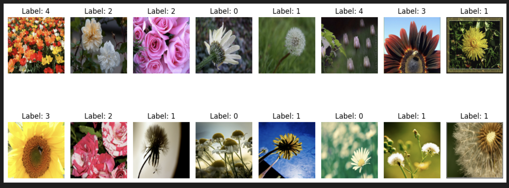
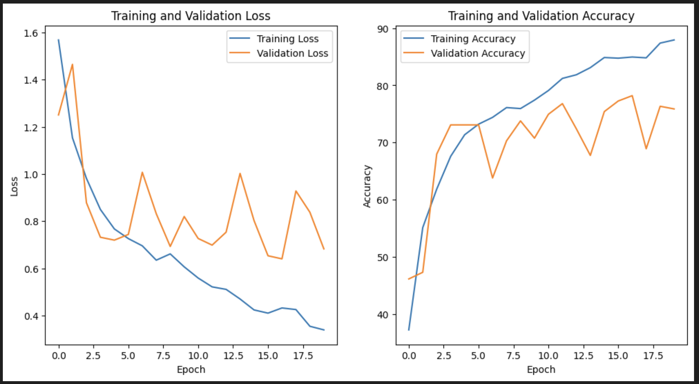
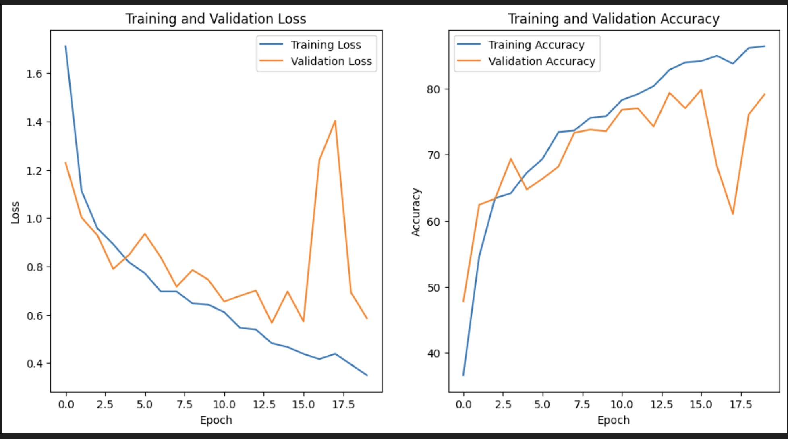
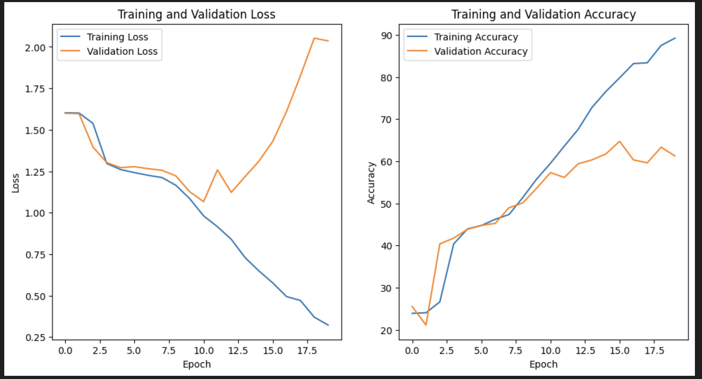
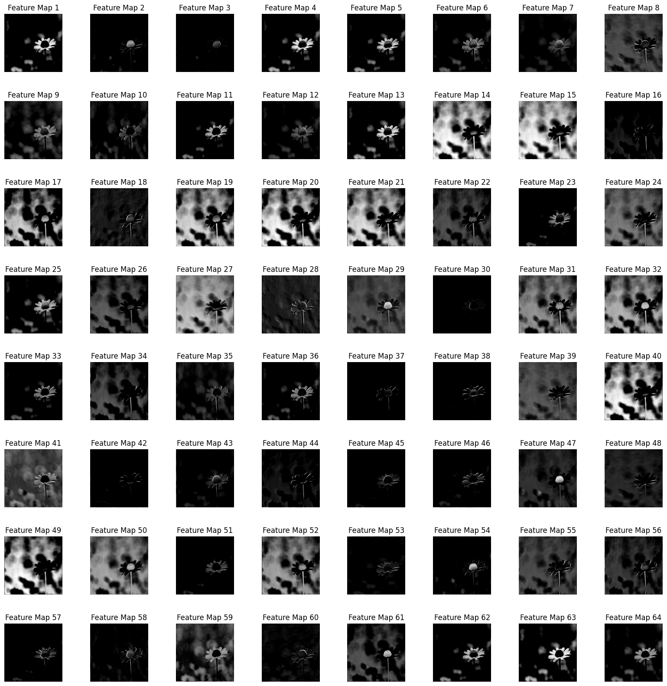
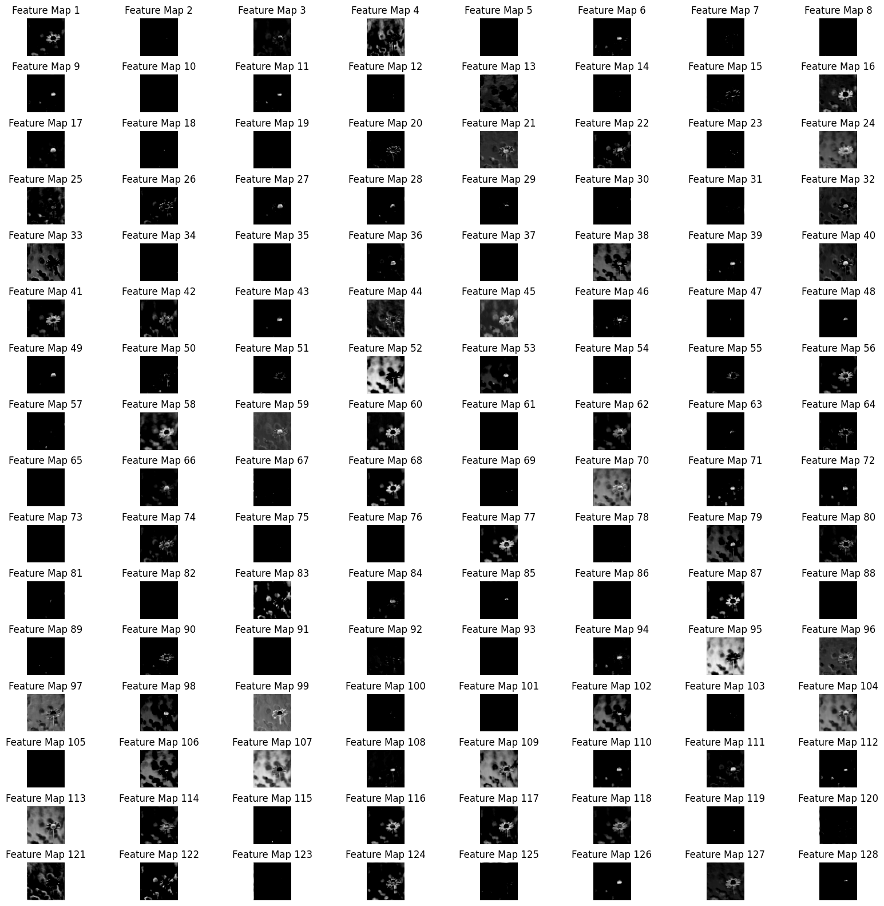

# Flower Classification — VGG16, ResNet & Inception (PyTorch)

Three progressively improved CNN architectures built entirely from scratch
in PyTorch for 5-class flower image classification.
Goes beyond a single model — compares VGG16, VGG16+ResNet skip connections,
and VGG16+Inception modules across multiple optimizers and learning rates.

---

### What it does

- Implements full VGG16 architecture from scratch with BatchNorm
- Implements VGG16 with ResNet-style skip connections as an improved variant
- Implements VGG16 with Inception modules (parallel 1×1, 3×3, 5×5 convolutions)
- Trains all three models for 20 epochs and compares loss + accuracy curves
- Runs a hyperparameter grid search across Adam, SGD, RMSProp and learning rates 0.001, 0.01, 0.1
- Visualises intermediate convolutional feature maps from each model
- Evaluates final test accuracy for each architecture

---

### Dataset

Flowers Recognition Dataset — [alxmamaev/flowers-recognition on Kaggle](https://www.kaggle.com/datasets/alxmamaev/flowers-recognition)

Loaded automatically via `kagglehub`.

| Class | Label |
|---|---|
| Daisy | 0 |
| Dandelion | 1 |
| Rose | 2 |
| Sunflower | 3 |
| Tulip | 4 |

**Sample images from dataset:**



---

### Architectures

**1. VGG16 (custom with BatchNorm)**
Conv Block 1  : Conv(3→64) × 2 + BatchNorm + MaxPool
Conv Block 2  : Conv(64→128) × 2 + BatchNorm + MaxPool
Conv Block 3  : Conv(128→256) × 3 + BatchNorm + MaxPool
Conv Block 4  : Conv(256→512) × 3 + BatchNorm + MaxPool
Conv Block 5  : Conv(512→512) × 3 + BatchNorm + MaxPool
Classifier    : FC(4096) → FC(4096) → FC(5) + Softmax

**2. VGG16 + ResNet Skip Connections**
Same VGG16 conv blocks

Residual skip connections between blocks
Helps gradient flow through deep layers


**3. VGG16 + Inception Module**
Inception block : parallel Conv(1×1) + Conv(3×3) + Conv(5×5) + MaxPool
All branches concatenated → richer multi-scale features

---

### Training Setup
Loss function   CrossEntropyLoss
Optimizer       Adam (lr = 0.0001) for individual training
Grid search: Adam / SGD / RMSProp × lr 0.001 / 0.01 / 0.1
Epochs          20 per model
Image size      224×224
Normalisation   mean=[0.5,0.5,0.5], std=[0.5,0.5,0.5]
Device          GPU (cuda) if available

---

### Training Curves

**VGG16 — Loss and Accuracy:**



**VGG16 + ResNet — Loss and Accuracy:**



**VGG16 + Inception — Loss and Accuracy:**



---

### Feature Maps

Intermediate convolutional feature maps show what each layer learns:

**Layer 0 feature maps:**



**Layer 1 feature maps:**



---

### Stack

| | |
|---|---|
| **Framework** | PyTorch · torchvision |
| **Data** | kagglehub |
| **Visualization** | Matplotlib · NumPy |
| **Language** | Python |

---

### Setup

```bash
pip install torch torchvision kagglehub matplotlib numpy tqdm

jupyter notebook 2_CNN_VGG16.ipynb
```

---
